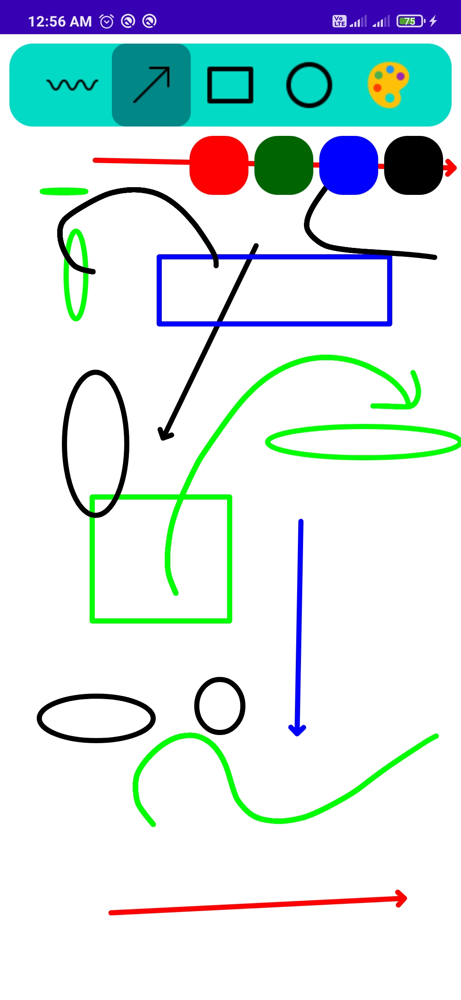

# Paint Application

It is an Android application capable of painting including some standard shapes.

# Technology Used
Kotlin

 
 

# Working Demo

 
<b>Home Page</b>

     
     

 
<b>Free Hand Drawing</b>

     
     

 
<b>Arrow headed line</b>

     
     

 
<b>Rectangular Shapes</b>

     
     

 
<b>Oval Shape</b>

     
     

 
<b>Combined All shapes in a Paint</b>

     
     

 

     
     

# Progress direction

    • Implementation of varible sized lines for every shape
    • Sharing of the painted image to the different apps like WhatsApp, etc.
